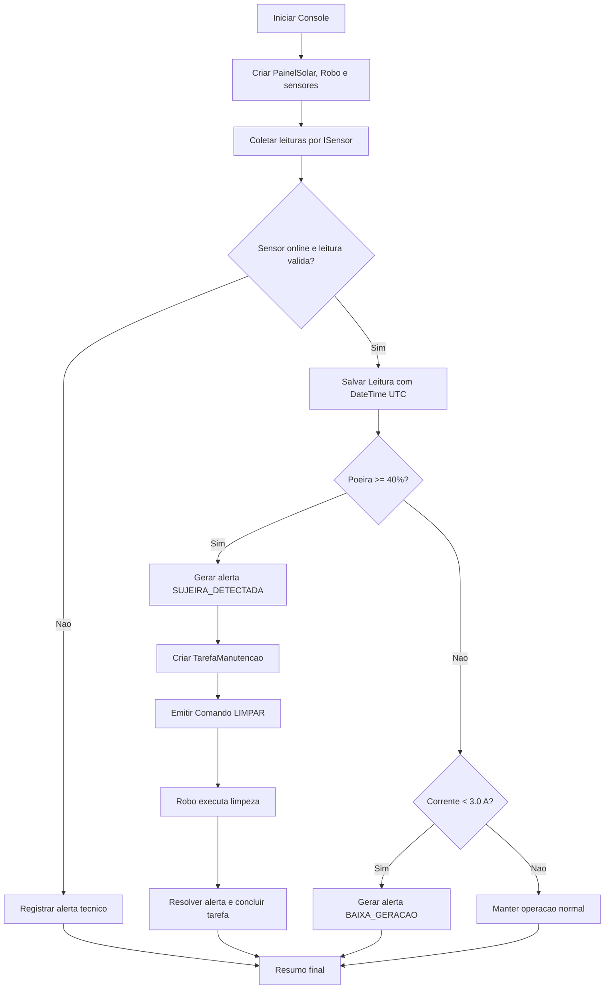

# Diagrama de fluxo - HELIOS C#

## Leitura do fluxo

O fluxo representa a regra central do dominio C#: receber leituras simuladas, validar excecoes, registrar historico com datas, decidir sobre alertas e comandar o rover HELIOS quando a poeira ultrapassa o limite.
